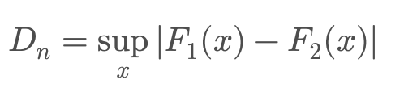

Сначала нужно зашарить базу:
- что такое дов интервал
- бутстрап - как оценить доверительный интервал для квантиля.
- Как ты проверяешь валидность теста и как распределено pvalue
  как проверяешь что распределение равномерное (критерий колмогорова смирнова)

*Итог:* нужно посмотреть cuped, линеаризация, стратификация, дельта метод, бутсрап, различные виды тестов. Нужно чтобы это отскакивало от зубов.

Дополнительно по статистике:

- Центральная предельная теорема (**ЦПТ**) - почему
- Критерий Chi-Square - показывает, насколько критерий соответствует тому распределению, которое мы задали.

#### Ошибки первого и второго рода

Нужно чётко понимать разницу и уметь объяснять на продуктовом примере:

- **Ошибка I рода (α)** — отклонили нулевую гипотезу, хотя она верна. «Запустили фичу, которая на самом деле не работает».
- **Ошибка II рода (β)** — не отклонили нулевую гипотезу, хотя она неверна. «Не запустили фичу, которая на самом деле работает».
- Мощность = 1 - β.

Как их контролировать: α задаём до теста (обычно 0.05), β контролируем через размер выборки.

## Тесты

Мы в аналитике используем различные стат методы и критерии, и у аналитика должно отскакивать от зубов как все это работает.
Нужно изучить эти тесты. Я спрошу продуктовый кейс по каждому из них.

==Тест стьюдента:==

- Предполагает, что дисперсии двух групп **равны** (гомогенность дисперсий).
- Более мощный при соблюдении этого условия.
- Использует **объединённую дисперсию** (pooled variance) для вычисления t-статистики.
- если сравниваются **зависимые** выборки (например, показатели до и после эксперимента у одних и тех же объектов).
- В каком предположении работает T-test а также строится доверительный интервал для случайной величины по выборке?

==Тест Уэлча:==

- **Не требует равенства дисперсий** в группах (гетерогенность дисперсий).
- Более **консервативный** тест (реже приводит к ложноположительным результатам при неравных дисперсиях).
- Использует **раздельные дисперсии** вместо объединённой оценки.

**Как проверить нормальность?**
**Q-Q график**, **Boxplot**, **Тест Шапиро-Уилка**, **Критерий Колмогорова-Смирнова**

==Манна Уитни==

- когда **неизвестно** распределение данных или когда данные не являются нормально распределёнными.
- используется для **двух независимых выборок**.
- Он проверяет **отличие между медианами** (а не средними, как t-тест).

==Критерий Вилкоксона==

- используется для **двух зависимых выборок (парных значений, до/после эксперимента)**.

==Критерий колмогорова смирнова==

- Проверяет, соответствует ли выборка заданному теоретическому распределению (например, нормальному, экспоненциальному и т. д.).
  
